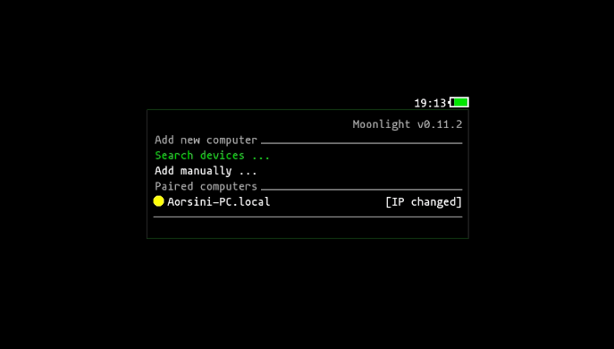
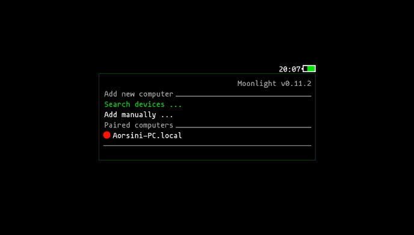
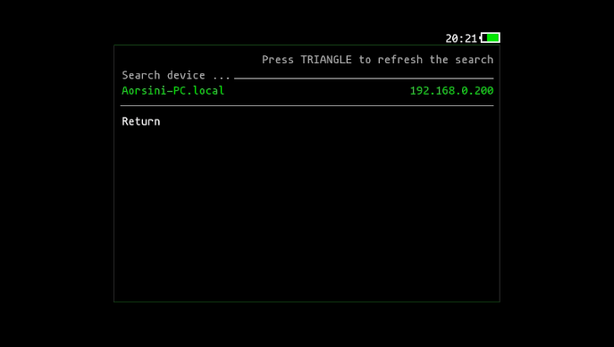

# Vita Moonlight

Vita Moonlight is a PlayStation Vita port of Moonlight, with major improvements for usability, pairing, device management, and now advanced touch and multitouch support.

## Highlights
  
**Advanced Host Management:** Manage paired hosts with:
  - Change host name
  - Change host IP
  - Delete hosts
  - Force connection even if host is not shown as online
- **L1/R1 and L2/R2 Swap:** You can now swap the functions of the L1/R1 and L2/R2 buttons from the settings menu for greater comfort and customization.
- **Gamepad Type Selection:** Choose whether you want the buttons and interface to behave as an Xbox or PlayStation controller, directly from the settings menu.

## Documentation

More information can find [moonlight-docs][1], [moonlight-embedded][2], and our [wiki][3].
If you need more help, join the #vita-help channel in [discord][4].

[1]: https://github.com/moonlight-stream/moonlight-docs/wiki
[2]: https://github.com/irtimmer/moonlight-embedded/wiki
[3]: https://github.com/xyzz/vita-moonlight/wiki
[4]: https://discord.gg/atkmxxT

## Upcoming Features

- **Artemis/Apollo compatibility:** Planned support for Artemis/Apollo (a modified Sunshine host), to allow streaming from more sources and custom servers.

Stay tuned for more improvements!

## How to open the Pause Menu

> **To open the pause menu at any time (even in any touch mode), press:**
> 
> **START + L + R**
>
> This shortcut works regardless of the selected touch mode (Absolute Mouse or Touchscreen). Use it to access the in-game pause/options menu quickly.

---

## How to open the Floating Keyboard

> **To open the elevated floating keyboard at any time, press:**
>
> **START + LEFT**
>
> This shortcut will always open the virtual keyboard in elevated mode, never covering the main screen. Works in all touch modes.

---

## What's New
**Advanced Host Management:**
  - Change host name
  - Change host IP
  - Delete hosts
  - Force connection even if host is not shown as online
- **L1/R1 and L2/R2 Swap:** You can now swap the functions of the L1/R1 and L2/R2 buttons from the settings menu.
- **Gamepad Type Selection:** Choose between Xbox and PlayStation controller layouts in the settings menu.
- **Automatic pairing fixed:** The pairing process is now more reliable and user-friendly. You can now pair your PC directly from the Vita using "Search device"—no more manual pairing required!
- **Absolute Touch (beta):** Experimental support for absolute touch controls.
- **Motion controls (gyroscope):** Play with motion aiming and gyro support for a more immersive experience.
- **Elevated floating keyboard:** The virtual keyboard now appears above the app, never covering the main screen (see screenshot below).
- **Updated libraries:** All dependencies and core libraries (moonlight-common-c, enet, inih) have been updated for better compatibility and stability.
- **New modular mDNS sniffer:** Fast and reliable device discovery on your local network.
- **Host status indicators:** Colored dots show if a host is online (green), offline (red), or needs IP update (yellow).
- **IP change detection:** If a host changes its IP, you'll see a confirmation dialog with the old and new IP before updating.
- **Manual refresh:** Press TRIANGLE (△) in the main menu or device search to refresh host/device status instantly.
- **UI and logic robust to missing/empty host fields.**
- **Improved debug logging and error handling.**
- **Many bugfixes and code cleanups.**

---

## Screenshots

<p align="center">
  
  <br><b>Floating keyboard in a Steam app using Moonlight</b>
</p>

<p align="center">
  
  <br><b>Host waiting for IP update (yellow)</b>
</p>

<p align="center">
  
  <br><b>Host online (green)</b>
</p>

<p align="center">
  
  <br><b>Host offline/disconnected (red)</b>
</p>

<p align="center">
  
  <br><b>IP change confirmation dialog (shows old/new IP)</b>
</p>

<p align="center">
  
  <br><b>Search device function showing a found local device</b>
</p>

---


## Build Requirements

- **VitaSDK** installed and configured on your system ([guide here](https://vitasdk.org/)).
- **Submodules updated:**
  ```sh
  git submodule update --init
  ```

---

## Quick Build

1. Install dependencies with [vdpm](https://github.com/vitasdk/vdpm) if you haven't already.
2. Make sure VitaSDK is installed and in your $PATH.
3. Run:
   ```sh
   ./makepsv
   ```
   This will generate a VPK file ready to install on your PS Vita.

---

## Manual Build (optional)

If you prefer to build manually:

```sh
# If you do git pull, make sure to update submodules first
 git submodule update --init
 mkdir build && cd build
 cmake ..
 make
```

---

## Note about colors in vita2d

> **Important:** The vita2d library interprets colors in BGRA format (not RGBA). For example:
> - 0xFF00FFFF will appear **yellow** (not cyan)
> - 0xFFFFFF00 will appear **blue** (not yellow)
> - 0xFF00FF00 will appear **green** (correct)
> - 0xFFFF0000 will appear **red** (correct)
>
> If the color does not look as expected, swap the byte order (use BGR instead of RGB).


Thanks to all contributors and the Moonlight community!

